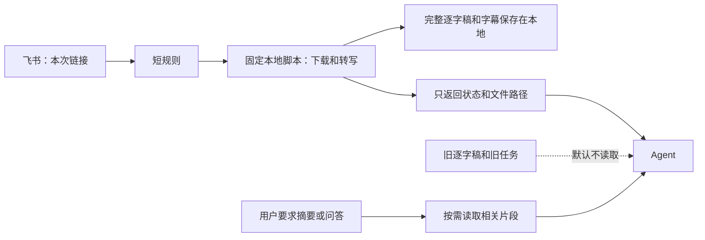

<div align="center">

# Link2Content

### 把链接发给 Agent，快速拿到本地逐字稿、字幕和内容素材。

[](https://github.com/saki-orbit/link-to-content/stargazers)
[](LICENSE)

</div>

我经常先把视频、播客和文章收藏起来，想着以后再看，结果吃灰。真要找一句原话，发现还得下载、转文字、再把结果搬进资料库。Link2Content 就是帮我解决这串重复操作的。

装上这个skill后，任何平台，任何形式【图/文/视频/音频...】。只要把链接发给你的 Agent，它会自己识别内容类型，整理出逐字稿、字幕、正文、OCR 和来源信息。



视频和播客使用一次批处理。脚本把完整结果留在磁盘，只返回状态和文件路径。Link2Content 不会为确认成功而重新读取整份逐字稿。只有你要求摘要、校对或问答时，Agent 才读取相关内容。飞书 Harness 是否保留旧聊天记录，由 Harness 自己控制。

## 它能帮你做什么

单条链接可以直接处理；多条链接可以一起发给 Agent，逐条整理。小红书博主主页支持批量归档，公众号文章支持单篇和合集。

### 目前支持

| 你发来的内容 | Link2Content 会做什么 | 默认产物 |
| --- | --- | --- |
| ✅ 小红书单篇笔记（Xiaohongshu / RedNote） | 读取正文；视频转写，图片做 OCR | `transcript.md` 或 `ocr.md`、`metadata.json` |
| ✅ 小红书博主主页 | 收集可访问作品并逐篇整理 | 每篇内容文件、`index.csv`、失败清单 |
| ✅ 抖音（Douyin）、快手（Kuaishou）、B 站（Bilibili）、微博（Weibo）、X（Twitter）、YouTube 视频 | 提取音轨并在本机转写 | `transcript.md`、`subtitles.srt`、`metadata.json` |
| ✅ 豆瓣（Douban）、知乎（Zhihu）帖子或文章 | 读取正文；有图片时做 OCR | 正文、`ocr.md`、`metadata.json` |
| ✅ 微信公众号文章（单篇 / 合集） | 读取文章正文；按合集逐篇整理，有图片时做 OCR | 正文、`ocr.md`、`metadata.json` |
| ✅ 小宇宙等播客 | 获取音频并在本机转写 | `transcript.md`、`subtitles.srt`、`metadata.json` |
| ✅ 多条内容链接 | 按链接分别整理，汇总处理结果 | 每条链接各自的素材目录 |

公众号文章可以直接发单篇链接，也可以发合集。没有合集、文章数量又不多时，逐条发文章链接就行。

单条内容链接不需要登录；只有小红书博主主页批量归档需要登录态。批量流程做过优化，我建议用小号；我自己用大号测试至今没有遇到封禁。

## 核心优势

### 2.1 单条链接覆盖全平台，批量提取覆盖全部主流平台

小红书、X、抖音、知乎、微博、豆瓣、快手、B 站、YouTube、播客等，单条链接直接发给 Agent 就能处理；多条链接也可以一次发来，逐条整理。

腾讯公众号单独说：单篇提取没有问题；多篇有合集就可以批量整理。没有合集、文章数量又少的话，还是要花一点时间手动复制文章链接。

### 2.2 本地批处理，减少重复上下文

视频和播客的下载、转写由固定脚本逐条完成。Agent 一次提交链接清单，脚本只返回处理状态和结果路径；完整逐字稿和字幕保存在本地，不会自动加入后续对话。需要摘要或问答时，再按需读取相关内容。

本地语音转写和图片 OCR 不把媒体本身交给云端模型。Apple 芯片 Mac 使用 FFmpeg 和 `mlx_whisper`；其他设备使用 faster-whisper；图片识别使用 RapidOCR。模型只需安装时下载一次。

我实测一条 3 分钟左右的视频，大约 8 秒得到 Markdown 逐字稿，成本约 8 分钱。Apple 芯片语音模型约 1.6 GB，只需下载一次。

### 2.3 零幻觉，99.9% 正确率：不是“能转写”，是“转出来能直接用”

能转写的工具已经很多了，但结果常常还得自己听一遍、改错字。我直接让 Codex 提取单个平台内容时，也遇到过乱码。

我在流程里加了人声检测、幻觉过滤和校对。用下来，逐字稿基本可以直接搜索和继续加工；唯一会额外消耗 Agent Token 的是模型校对逐字稿这一步。

### 2.4 封号风险降到最低，无限趋近安全

|  | **其他 Skill** | **Link2Content** |
| :---: | :--- | :--- |
| 登录用在哪 | 全流程：开着浏览器输入、截图、记录 | **只在拿到链接这一步** |
| 对平台的请求量 | 一个词根可能有 100+ 次页面操作 | **单条链接约 1 次下载** |
| 登录之后 | 继续在登录态里操作 | **后续处理在本地完成** |

```text
✅ 单条链接 → 内容：零登录（已实测：yt-dlp 匿名下载小红书视频成功）
✅ 搜索 / 榜单：需要登录态，由用户自己处理
✅ 工具本身不保存、不写入、不持有你的登录态；登录只发生在你自己的浏览器里
```

其他工具需要一直开着浏览器才能工作；Link2Content 只在最开始接触平台，之后的转写、OCR 和整理都在本地完成。

> **其他工具是“用你的号帮你刷小红书”；我做的是“你给个链接，剩下的活跟小红书没关系”。**

## 为什么我做这个

我想把真正有价值的东西沉淀下来，而不是让它们在收藏夹里吃灰，或被繁琐的整理流程消耗。把视频和播客变成文字，也让我能用阅读代替刷短视频，把时间留给真正想学的内容。

如果你现在每个月要为提取内容花几百甚至几千块，可以先拿自己常用的一条链接试试。

## 整理完会拿到什么

- `transcript.md`：保留原语言和说话顺序的逐字稿。
- `subtitles.srt`：带时间轴的字幕。
- `metadata.json`：标题、平台、来源链接、作者、发布时间、时长、语言等信息。
- `ocr.md`：图文内容和文章图片中识别出的文字。
- `index.csv`：博主主页归档的作品索引。

当然，我们非常鼓励你根据自己的需求改造。这也是我做这个 Skill 的初衷：提供一个尽量通用的工具，给大家留下定制和创造的空间。

## 安装和使用教程

把这句话发给你的 Agent：

```text
帮我安装并启用 Link2Content：https://github.com/saki-orbit/link-to-content/tree/main/skills/multi-platform-media-transcript
```

装好后，直接把链接发给 Agent：

> https://…… 帮我转成逐字稿。

## 几种用法（持续更新中）

### 给知识博主做一份可检索的资料库

把小红书博主主页交给归档 Skill，逐篇得到视频逐字稿和图文 OCR。整理结果可以放进本地资料库；如果你的 Agent 已连接飞书多维表格，也可以继续写入表格。之后问问题时，让 Agent 从这些原文里找依据。

### 电饭锅帖子 TOP3 整理进飞书多维表格

我在 DSH Harness 里试过这样一句话：“在小红书搜索电饭锅，找点赞最多的前 3 个帖子，把链接、标题和相关内容整理到一张多维表格里。”它把标题、作者、点赞、收藏、评论、分享、正文描述、话题标签和封面图整理进表格。这个演示用到了 DSH Harness 和飞书多维表格能力。


### 把一小时播客变成能搜索的文字

我曾把《硅谷 101》E253 的链接发给 Agent，约 8 分钟后拿到文字稿。等待的时候我在食堂吃饭，回来就能继续查找和引用内容。

小宇宙链接发进 DSH Harness 后，会话结束时给我一份本地 Markdown 文档：


把自己选中的内容整理好，再让 Agent 从这些原始材料里检索和引用，逐步搭出一个真正可用的知识库。

## 一起完善

如果你觉得 Link2Content 对你有帮助，欢迎点个小星星（Star），这对我真的很重要！遇到问题，欢迎提交 Issue 或 PR，也可以直接来群里交流。

## 独立 Skills

一般安装上面的 Link2Content 通用入口就够了。如果你只想使用其中部分功能，这里也保留了单独安装的入口：

- [小红书博主作品归档](https://github.com/saki-orbit/link-to-content/tree/main/skills/xiaohongshu-creator-archive)
- [X / B 站单条视频转写](https://github.com/saki-orbit/link-to-content/tree/main/skills/x-bilibili-transcript)
- [播客整理到飞书](https://github.com/saki-orbit/link-to-content/tree/main/skills/podcast-to-feishu)

## 加入交流群

欢迎来群里交流用法、反馈问题，也欢迎在 GitHub 提 Issue 或 PR。


> 当前二维码截图显示有效期至 2026 年 10 月 8 日，之后需要换新码。

## License

本项目采用 [MIT License](LICENSE)。

## 免责声明

> 请以学习为目的使用本仓库 ⚠️⚠️⚠️⚠️
>
> 本仓库的所有内容仅供学习和参考，禁止用于商业用途。任何个人或组织不得将本仓库内容用于非法用途或侵犯他人合法权益。本仓库涉及的爬虫技术仅用于学习和研究，不得用于对其他平台进行大规模爬取或其他违法行为。因使用本仓库内容而引起的法律责任，由使用者自行承担。使用本仓库即表示您同意本免责声明的所有条款。
