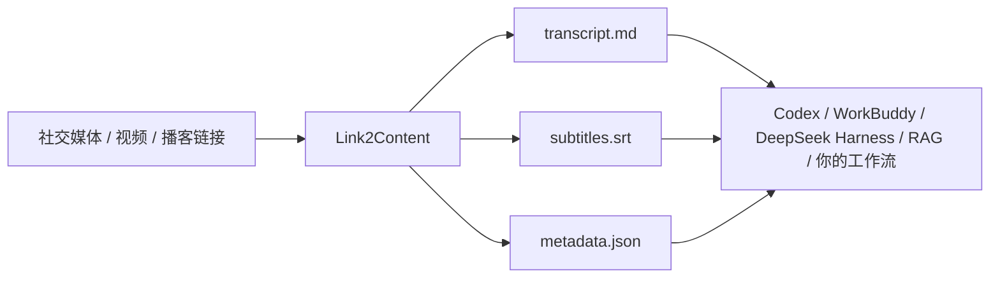

<div align="center">

# Link2Content

### 把社交媒体和播客链接，变成 Agent 能直接使用的本地内容。

[](https://github.com/saki-orbit/link-to-content/stargazers)
[](LICENSE)

**你发链接，拿到逐字稿、字幕和来源信息。**

</div>

Agent 可以分析内容，前提是先拿到内容。Link2Content 把下载、抽音轨、转写和素材整理串成一个简单动作：**复制链接，发给 Agent，拿到可搜索、可复用的本地素材。**



## 5 秒看懂

```text
你：把这条 B 站视频整理成 Agent 能用的本地素材：<视频链接>

Link2Content：
  transcript.md    逐字稿
  subtitles.srt    带时间轴字幕
  metadata.json    标题、平台、来源和时长
```

## 支持的内容

| 来源 | 单条链接 | 主页归档 | 内容提取 | 主要产物 |
| --- | --- | --- | --- | --- |
| 小红书 | 笔记链接 | 博主公开作品 | 视频转写、图文 OCR | 逐篇素材、索引和失败清单 |
| X | 视频链接 | — | 逐字稿 | `transcript.md`、`subtitles.srt`、`metadata.json` |
| B 站 | 视频链接 | — | 逐字稿 | `transcript.md`、`subtitles.srt`、`metadata.json` |
| YouTube 及其他媒体站点 | 音视频链接 | — | 逐字稿 | `transcript.md`、`subtitles.srt`、`metadata.json` |
| 小宇宙播客 | 单集链接 | — | 逐字稿、精华整理 | 本地素材和飞书文档 |

小红书主页批量归档使用登录态；单条作品链接不需要登录。批量流程做了针对性优化，建议使用小号。作者本人使用大号测试至今没有遇到封禁。

## 每条内容的标准产物

- `transcript.md`：逐字稿或音频转写。
- `subtitles.srt`：带时间轴字幕。
- `metadata.json`：统一描述内容来源，字段为 `title`、`platform`、`source_url`、`creator`、`published_at`、`duration_seconds`、`language` 和 `engines`。无法获取的值写为 `null`。
- 小红书图文笔记额外生成 `ocr.md`；主页归档额外生成 `index.csv`。

## 为什么用 Link2Content

- **从链接开始**：不用先找下载器、手动抽音频，再把文件送去转写。
- **处理快，少花 Token**：语音转写在本机完成。作者实测，2 分 48 秒的中文口播约 25 秒完成转写。
- **产物能接着用**：逐字稿、字幕、元数据可以直接交给 Codex、WorkBuddy、DeepSeek Harness、RAG 或自己的内容工作流。
- **平台不绑死**：小红书、X、B 站、YouTube、播客分别有对应 Skill；用户给链接，Agent 负责跑流程。

## 三步开始使用

### 1. 选一个 Skill

- [小红书博主作品归档](https://github.com/saki-orbit/link-to-content/tree/main/skills/xiaohongshu-creator-archive)
- [X / B 站单条转写](https://github.com/saki-orbit/link-to-content/tree/main/skills/x-bilibili-transcript)
- [多平台链接转文字](https://github.com/saki-orbit/link-to-content/tree/main/skills/multi-platform-media-transcript)
- [播客精华进飞书](https://github.com/saki-orbit/link-to-content/tree/main/skills/podcast-to-feishu)

### 2. 把 Skill 页面地址发给 Agent

例如，把 [X / B 站转写 Skill](https://github.com/saki-orbit/link-to-content/tree/main/skills/x-bilibili-transcript) 的地址粘贴给 Agent，再说：

> 请安装并启用这个 Skill。安装完成后告诉我怎么调用。

### 3. 发内容链接

> 把这个视频转成逐字稿和带时间戳的字幕：`<视频链接>`

### Codex、WorkBuddy 和 DeepSeek Harness

- **Codex**：在 Codex 中发送 `$skill-installer install https://github.com/saki-orbit/link-to-content/tree/main/skills/x-bilibili-transcript`。安装后重启 Codex。也可以换成上面的其他 Skill 地址。
- **WorkBuddy**：把 Skill 页面地址发给 Agent 并要求安装；也可以在“技能 → 添加技能”中导入 Skill 包。详见[WorkBuddy 技能指南](https://www.workbuddy.cn/docs/workbuddy/From-Beginner-to-Expert-Guide/Function-Description/Skills-Market)。
- **DeepSeek Harness**：把仓库地址发给 Agent 并要求安装所需 Skill；也可以在仓库目录运行 `bash scripts/install-to-dsh.sh x-bilibili-transcript`。

## 加入共建

觉得 Link2Content 有用？点 Star 支持项目。欢迎提 Issue 分享体验，也欢迎提交 PR 一起完善。

## 独立 Skills

每个目录都能单独安装、单独使用：

- `skills/xiaohongshu-creator-archive`
- `skills/x-bilibili-transcript`
- `skills/multi-platform-media-transcript`
- `skills/podcast-to-feishu`
