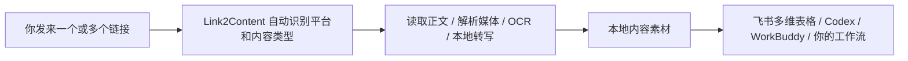
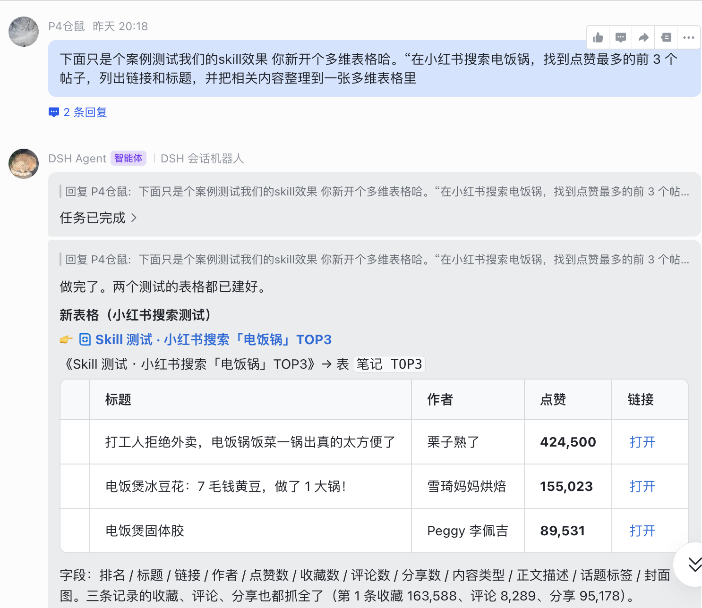
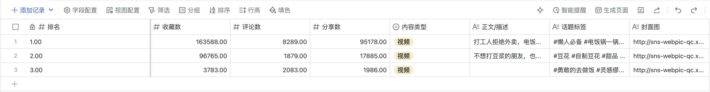
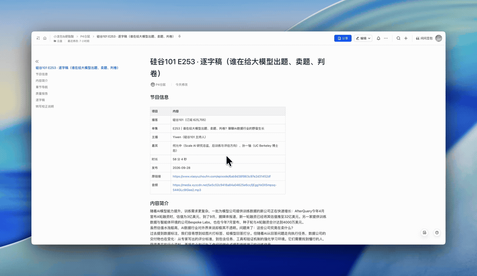
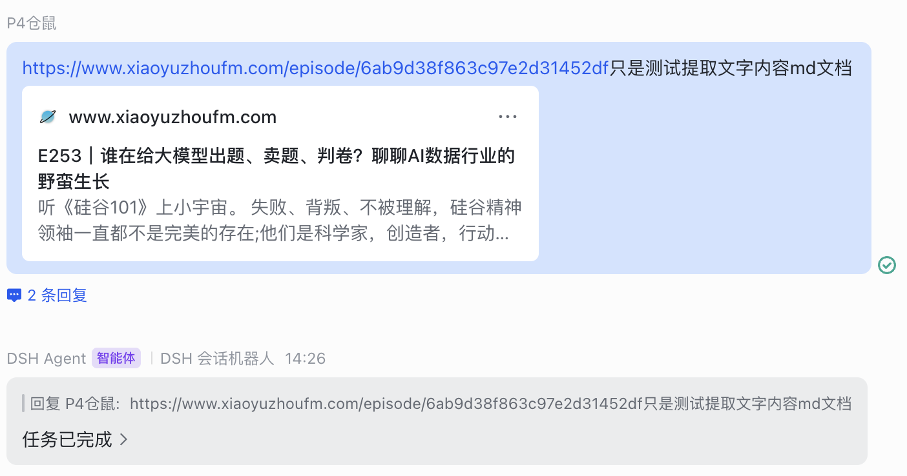

<div align="center">

# Link2Content

### 把链接发给 Agent，快速拿到本地逐字稿、字幕和内容素材。

[](https://github.com/saki-orbit/link-to-content/stargazers)
[](LICENSE)

</div>

我经常先把视频、播客和文章收藏起来，想着以后再看。真要找一句原话，才发现还得下载、转文字、再把结果搬进资料库。Link2Content 就是帮我省掉前面这串重复操作的。

装好之后，不用先挑平台或 Skill。把链接发给 Agent，它会自己识别内容类型，整理出逐字稿、字幕、正文、OCR 和来源信息。



## 它能帮你做什么

单条链接可以直接处理；多条链接可以一起发给 Agent，逐条整理。小红书博主主页支持批量归档，公众号文章支持单篇和合集。

### 目前支持

| 你发来的内容 | Link2Content 会做什么 | 默认产物 |
| --- | --- | --- |
| 小红书单篇笔记（Xiaohongshu / RedNote） | 读取正文；视频转写，图片做 OCR | `transcript.md` 或 `ocr.md`、`metadata.json` |
| 小红书博主主页 | 收集可访问作品并逐篇整理 | 每篇内容文件、`index.csv`、失败清单 |
| 抖音（Douyin）、快手（Kuaishou）、B 站（Bilibili）、微博（Weibo）、X（Twitter）、YouTube 视频 | 提取音轨并在本机转写 | `transcript.md`、`subtitles.srt`、`metadata.json` |
| 豆瓣（Douban）、知乎（Zhihu）帖子或文章 | 读取正文；有图片时做 OCR | 正文、`ocr.md`、`metadata.json` |
| 微信公众号文章（单篇 / 合集） | 读取文章正文；按合集逐篇整理，有图片时做 OCR | 正文、`ocr.md`、`metadata.json` |
| 小宇宙等播客 | 获取音频并在本机转写 | `transcript.md`、`subtitles.srt`、`metadata.json` |
| 多条内容链接 | 按链接分别整理，汇总处理结果 | 每条链接各自的素材目录 |

公众号文章可以直接发单篇链接，也可以发合集。没有合集、文章数量又不多时，逐条发文章链接就行。

单条内容链接不需要登录；只有小红书博主主页批量归档需要登录态。批量流程做过优化，我建议用小号；我自己用大号测试至今没有遇到封禁。

## 核心优势

### 视频转写、图片 OCR 都在本机跑

Whisper 转写和 OCR 都在本机跑，不用云端模型处理整段内容；这两步不花 Agent Token。Skill 安装时会自动准备本地依赖和模型：Apple 芯片 Mac 使用 MLX Whisper，其他设备使用 faster-whisper；图片识别使用 RapidOCR。Whisper 权重只下载一次，缓存在本机，后续直接复用。首次安装需要联网下载约 1.6 GB 的 Apple 芯片语音模型。

我自己的 DSH 流程还会做人声检测、幻觉过滤和模型校对，校对时才会额外消耗 Agent Token。我用下来，稿子基本能直接搜索和继续加工。我最近测了一条约 3 分钟的视频，大概 8 秒拿到 Markdown 逐字稿，成本约 8 分钱。

### 拿到的是文件，后面能接着用

视频和播客会整理成 `transcript.md`、`subtitles.srt`、`metadata.json`；图文内容会有正文和 OCR 文件。带来源的素材可以放进自己的资料库或飞书多维表格，再用常用的 Agent 检索、引用或继续加工。

我在意的不只是“能转写”，而是稿子整理好之后，不用再手动复制搬运。专业名词或口误需要再核对时，也可以让 Agent 校对一遍。

## 为什么我做这个

我自己的感觉是，X 上的简中 AI 内容绕来绕去，无非是搞钱、搞流量，或者薅羊毛省钱。Link2Content 想先解决一个我自己遇到的问题：把选中的内容留好，省下找工具、转文字、搬资料的时间。

如果你现在每个月要为提取内容花几百甚至几千块，可以先拿自己常用的一条链接试试。

## 整理完会拿到什么

- `transcript.md`：保留原语言和说话顺序的逐字稿。
- `subtitles.srt`：带时间轴的字幕。
- `metadata.json`：标题、平台、来源链接、作者、发布时间、时长、语言等信息。
- `ocr.md`：图文内容和文章图片中识别出的文字。
- `index.csv`：博主主页归档的作品索引。

## 安装一次，以后直接发链接

把下面这段话发给你常用的 Agent。它会安装 Skill、运行里面的本地环境安装脚本，并把 Whisper 和 OCR 模型准备好：

```text
请帮我安装并启用 Link2Content 这个 Skill：
https://github.com/saki-orbit/link-to-content/tree/main/skills/multi-platform-media-transcript
请把这个 Skill 文件夹及其 scripts 一起安装。安装完成后，自动运行 Skill 自带的本地环境安装脚本，安装转写、OCR、网页解析依赖并预下载模型；等脚本确认成功后再告诉我。之后我会直接发内容链接，请自动识别平台和内容类型，用 Link2Content 整理成逐字稿、字幕、正文或 OCR 文件，保存在本地。不要让我先选平台或 Skill。
```

之后就直接发链接，或者顺手说你希望拿到什么：

> https://…… 帮我转成逐字稿和带时间轴的字幕。

### 常见 Agent 怎么安装

- **Codex**：发送 `$skill-installer install https://github.com/saki-orbit/link-to-content/tree/main/skills/multi-platform-media-transcript`，安装后重启 Codex。
- **WorkBuddy**：把上面的安装说明和 Skill 地址发给 Agent；也可以在“技能 → 添加技能”中导入。可参考 [WorkBuddy 技能指南](https://www.workbuddy.cn/docs/workbuddy/From-Beginner-to-Expert-Guide/Function-Description/Skills-Market)。
- **DeepSeek Harness**：把上面的安装说明和仓库地址发给 Agent；如果你已经克隆仓库，也可以运行 `bash scripts/install-to-dsh.sh multi-platform-media-transcript`。

## 几种用法

### 给知识博主做一份可检索的资料库

把小红书博主主页交给归档 Skill，逐篇得到视频逐字稿和图文 OCR。整理结果可以放进本地资料库；如果你的 Agent 已连接飞书多维表格，也可以继续写入表格。之后问问题时，让 Agent 从这些原文里找依据。

### 电饭锅帖子 TOP3 整理进飞书多维表格

我在 DSH Harness 里试过这样一句话：“在小红书搜索电饭锅，找点赞最多的前 3 个帖子，把链接、标题和相关内容整理到一张多维表格里。”它把标题、作者、点赞、收藏、评论、分享、正文描述、话题标签和封面图整理进表格。这个演示用到了 DSH Harness 和飞书多维表格能力。





### 把一小时播客变成能搜索的文字

我曾把《硅谷 101》E253 的链接发给 Agent，约 8 分钟后拿到文字稿。等待的时候我在食堂吃饭，回来就能继续查找和引用内容。

小宇宙链接发进 DSH Harness 后，会话结束时给我一份本地 Markdown 文档：





我不打算替你决定该怎么分析这些材料。先把自己选中的内容整理好，再让 Agent 基于你认可的资料回答问题，这也是给自己的知识库打底。

## 一起完善

我自己也会继续用它整理内容。你试过之后，欢迎告诉我哪一步最顺、哪一步卡住了。觉得它对你有用，点个 Star 支持我继续完善；遇到问题可以提 Issue，也欢迎直接提交 PR。

## 独立 Skills

平时只需要安装上面的 Link2Content 通用入口。仓库里也保留了几个可以单独安装的流程，适合只想用其中某一项的情况：

- [小红书博主作品归档](https://github.com/saki-orbit/link-to-content/tree/main/skills/xiaohongshu-creator-archive)
- [X / B 站单条视频转写](https://github.com/saki-orbit/link-to-content/tree/main/skills/x-bilibili-transcript)
- [播客整理到飞书](https://github.com/saki-orbit/link-to-content/tree/main/skills/podcast-to-feishu)

## 加入交流群

欢迎来群里交流用法、反馈问题，也欢迎在 GitHub 提 Issue 或 PR。


> 当前二维码截图显示有效期至 2026 年 10 月 8 日，之后需要换新码。

## License

本项目采用 [MIT License](LICENSE)。
