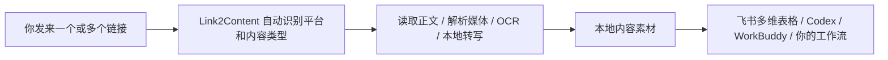

<div align="center">

# Link2Content

### 把链接发给 Agent，整理成可以继续用的本地内容素材。

[](https://github.com/saki-orbit/link-to-content/stargazers)
[](LICENSE)

</div>

嗨，欢迎来试试 Link2Content 👋

我把自己用了两周的一套内容处理流程整理成了这个 Agent Skill。平时看到一条视频、播客或笔记，想留着以后查、做笔记，或者交给 AI 接着处理，前面总要先找下载方式、抽音频、转文字。Link2Content 想帮你把这几步接起来。

**安装一次。之后直接把链接发给 Agent。**它会自己判断平台和内容类型，按对应流程处理，你不用先挑“这是哪个平台、该用哪个 Skill”。



## 用起来是什么样

你把链接发过去，可以只说：

> 帮我把这个链接整理一下。

处理后会在本地得到逐字稿、字幕和来源信息；图文内容会另外整理 OCR 文字。后续你可以把这些文件放进自己的资料库、飞书多维表格，或者继续交给 Agent 分析。

## 支持的内容

| 你发来的内容 | Link2Content 会做什么 | 默认产物 |
| --- | --- | --- |
| 小红书单篇笔记 | 读取正文；视频转写，图片做 OCR | `transcript.md` 或 `ocr.md`、`metadata.json` |
| 小红书博主主页 | 收集可访问作品并逐篇整理 | 每篇内容文件、`index.csv`、失败清单 |
| 微博、X、B 站、YouTube 等视频 | 提取音轨并在本机转写 | `transcript.md`、`subtitles.srt`、`metadata.json` |
| 小宇宙等播客 | 获取音频并在本机转写 | `transcript.md`、`subtitles.srt`、`metadata.json` |
| 多条内容链接 | 按链接分别整理，汇总处理结果 | 每条链接各自的素材目录 |

小红书单篇作品不需要登录；博主主页批量归档需要登录态。批量流程做过优化，我建议用小号；我自己用大号测试至今没有遇到封禁。

## 整理完会拿到什么

- `transcript.md`：保留原语言和说话顺序的逐字稿。
- `subtitles.srt`：带时间轴的字幕。
- `metadata.json`：标题、平台、来源链接、作者、发布时间、时长、语言等信息。
- `ocr.md`：小红书图文笔记中识别出的文字。
- `index.csv`：博主主页归档的作品索引。

## 安装一次，以后直接发链接

把下面这段话和 Skill 地址一起发给你的 Agent：

```text
请帮我安装并启用这个 Skill：
https://github.com/saki-orbit/link-to-content/tree/main/skills/multi-platform-media-transcript

安装好之后，我会直接把小红书、微博、X、B站、YouTube、播客等内容链接发给你。请自动判断平台和内容类型，使用 Link2Content 处理，不要让我先选择对应的平台 Skill。默认把逐字稿、SRT 字幕、来源信息和图文 OCR 整理成文件，保存在本地。安装完成后告诉我，之后直接发链接就可以。
```

之后就直接发链接，或者顺手说你希望拿到什么：

> https://…… 帮我转成逐字稿和带时间轴的字幕。

### 常见 Agent 怎么安装

- **Codex**：发送 `$skill-installer install https://github.com/saki-orbit/link-to-content/tree/main/skills/multi-platform-media-transcript`，安装后重启 Codex。
- **WorkBuddy**：把上面的安装说明和 Skill 地址发给 Agent；也可以在“技能 → 添加技能”中导入。可参考 [WorkBuddy 技能指南](https://www.workbuddy.cn/docs/workbuddy/From-Beginner-to-Expert-Guide/Function-Description/Skills-Market)。
- **DeepSeek Harness**：把上面的安装说明和仓库地址发给 Agent；如果你已经克隆仓库，也可以运行 `bash scripts/install-to-dsh.sh multi-platform-media-transcript`。

## 我为什么做这个

我想要的不是一份平台数据报表。我只是想把自己选中的内容顺手存下来，之后能搜索、能引用，也能让 Agent 接着用。所以默认先把原内容整理好；摘要、拆解、改写这些，按你的工作流再接上去。

转写在本机完成，处理速度快，也少花 Token。我自己测过，一段 2 分 48 秒的中文口播，大约 25 秒完成转写。

## 一起完善

我自己也会继续用它整理内容。你试过之后，欢迎告诉我哪一步最顺、哪一步卡住了。觉得它对你有用，点个 Star 支持我继续完善；遇到问题可以提 Issue，也欢迎直接提交 PR。

## 独立 Skills

平时只需要安装上面的 Link2Content 通用入口。仓库里也保留了几个可以单独安装的流程，适合只想用其中某一项的情况：

- [小红书博主作品归档](https://github.com/saki-orbit/link-to-content/tree/main/skills/xiaohongshu-creator-archive)
- [X / B 站单条视频转写](https://github.com/saki-orbit/link-to-content/tree/main/skills/x-bilibili-transcript)
- [播客整理到飞书](https://github.com/saki-orbit/link-to-content/tree/main/skills/podcast-to-feishu)
